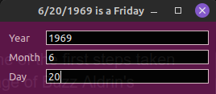

# WhichDayWas

Which day was what?<br>
What a dumb name for an app, right?<br>  
Okay, which day was it when Buzz Aldrin walked on the moon?<br> 
We know the date, so let's find out.<br>



<p>
This is a simple app that tells the weekday of any date you type in. I know you could just look it up on a calendar app, ask AI, or whatever, but this was a fun proof of concept using <b>Zeller's Congruence Algorithm</b>.
</p>

<p>
   I wrote the original app with a <b>Tkinter</b> interface (which you can find in the project legacy directory).<br>
   This new version looks much better, thanks to <b>PySide6</b>.<br>
   It's not drastically different in functionality, but hey, it's all about the small improvements!
</p>

### The algorithm used:
```
h = (q + 13*(m+1)//5 + d + y + (y//4) - (c//4)) % 7

where:
- q is day of the month
- m is the month (3 = March, ..., 12 = December)
- d is the day of the week (0 = Saturday, 1 = Sunday, ..., 6 = Friday)
- y is the year (e.g., 1988)
- c is the century (e.g., 19 for 1988)
```

<p>
It works pretty slick! I don't know how accurate it is, but I haven't seen any errors to date. (See what I did there?) 
</p>

<p>
You can also use this as a class for other projects if needed.
</p>

### Installation Instructions

To get started with this app, follow these steps:

1. **Clone the repository**  
   Run the following command to clone the repository to your local machine:
   ```
   git clone https://github.com/endorpheus/WhichDayWas.git
   cd WhichDayWas
   ```

2. **Install the required dependencies**  
   This app relies on PySide6 for the interface. Install the required dependencies using pip:
   ```
   pip install -r requirements.txt
   ```
   If `requirements.txt` is not present, you can manually install PySide6 with:
   ```
   pip install PySide6
   ```
   Ever thus for other missing prerequisites.

3. **Run the app**  
   Once everything is set up, you can run the app with:
   ```
   python WhichDayWas.py &
   ```

4. **App Icon**  
   The app uses a custom icon, but if for some reason the icon file is missing or not loading, it will generate a cheerful sun symbol instead!<br>
   You can always snag the original from the project icons directory.

5. **Enjoy!**  
   The app will display a system tray icon, and you can interact with it by right-clicking to show options like "About" or "Quit." Left-clicking the tray icon will show or hide the main window.

<p>
   I hope you enjoy using the app as much as I enjoyed building it!
   <br><br>
   Feel free to explore the code and see how <a href="https://en.wikipedia.org/wiki/Zeller%27s_congruence">Zeller's Congruence</a> works behind the scenes. 
</p>

# Media Attribution

For info on media used: 

### Thanks
<b>Ryon Shane Hall</b>   
<p>ryonshanehall.com</p>
